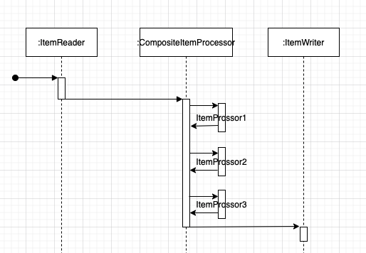

7.ItemProcessor
--

#### 잡이 처리하는 아이템에 비즈니스 로직을 적용하는 곳
-> 커스텀한 방법으로 비즈니스 로직을 개발하고,   
필요에 맞게 로직을 적용하는 방법을 결정하게 해준다.

#### ItemProcessor
-> 스프링 배치 내에서 입력데이터를 이용해 어떤 작업을 수행하는 컴포넌트   

```java
public interface ItemProcessor<I, O> {
    @Nullable
    O process(@NonNull I input) throws Exception;
}
```
-> O type은 ItemWriter가 입력으로 사용하는 타입이 돼야 한다.   
-> null을 반환하면 해당 아이템의 이후 모든 처리가 중지된다.   
(=ItemWriter에서 처리가 되지 않는다.)

#### 일반적인 용도
1. 필터링   
-> ItemReader가 읽은 아이템을 ItemWriter에서 쓰기 처리 하지 않도록 필터링
2. 변환    
-> ItemReader가 읽은 아이템을 변환하여 ItemWriter로 전달

#### 역할
1. 입력의 유효성 검사   
-> ItemProcessor가 유효성을 검증을 수행하면, ItemWriter에서 처리 전에 유효성 검증을 수행할 수 있다.   
(분업 관점에서 큰 의미를 가짐)
2. 기존 서비스의 재사용   
-> ItemProcessorAdapter를 제공하여 기존 서비스를 재사용할 수 있다.
3. 스크립트 실행   
-> 특정 스크립트를 실행하여 스크립트의 출력으로 반환값을 얻을 수 있다.   
(스프링기능을 사용하지 않는 팀과의 협업 가능)
4. ItemProcessor의 체인   
-> 각 아이템에 대해 순서대로 실행될 ItemProcessor를 정의할 수 있다.

---

### 스프링 배치의 ItemProcessor 사용하기

#### ValidatingItemProcessor - 입력 데이터의 유효성 검증

프로세서의 처리 전에 입력 아이템의 유효성 검증에 실패하면 `ValidationException`이 발생하여 
일반적인 스프링 배치 오류 처리 절차대로 진행된다.

```java
package org.springframework.batch.item.validator;

public class ValidatingItemProcessor<T> implements ItemProcessor<T, T>, InitializingBean {
    // ...    
}
```

```java
// 유효성 검증 애너테이션을 적용한 Customer 객체
@Data
public class Customer {
    @NotNull(message="First name is required")
    @Pattern(regexp="[a-zA-Z]+", message="First name must be alphabetical")
    private String firstName;

    @NotNull(message="Last name is required")
    @Pattern(regexp="[a-zA-Z]+", message="Last name must be alphabetical")
    private String lastName;

    @NotNull(message="City is required")
    @Pattern(regexp="[a-zA-Z\\. ]+")
    private String city;

    @NotNull(message="Zip is required")
    @Size(min=5,max=5)
    @Pattern(regexp="\\d{5}")
    private String zip;
}
```

```java
@Configuration
@RequiredArgsConstructor
public class ValidatingItemProcessorConfiguration {
    private final JobBuilderFactory jobBuilderFactory;
    private final StepBuilderFactory stepBuilderFactory;

    private static final int CHUNK_SIZE = 5;

    @Bean
    public Job ValidatingItemProcessorJob() {
        return this.jobBuilderFactory.get("ValidatingItemProcessorJob")
                .start(ValidatingItemProcessorStep())
                .incrementer(new UniqueRunIdIncrementer())
                .build();
    }

    @Bean
    public Step ValidatingItemProcessorStep() {
        return this.stepBuilderFactory.get("ValidatingItemProcessorStep")
                .<Customer, Customer>chunk(CHUNK_SIZE)
                .reader(reader())
                .processor(validatingItemProcessor())
                .writer(writer())
                .build();
    }

    @Bean
    public FlatFileItemReader<Customer> reader() {
        return new FlatFileItemReaderBuilder<Customer>()
                .name("reader")
                .resource(new ClassPathResource("ch8/lab1/inputFile.csv"))
                .delimited().delimiter(",")
                .names(new String[]{
                        "firstName"
                        ,"lastName"
                        ,"city"
                        ,"zip"
                })
                .targetType(Customer.class)
                .build();
    }

    @Bean
    public BeanValidatingItemProcessor<Customer> validatingItemProcessor() {
        return new BeanValidatingItemProcessor<>();
    }
 
    @Bean
    public ItemWriter writer() {
        return items -> items.forEach(item -> log.info("{}", item));
    }
}
```

```csv
hosik,ham,seoul,12311
hosik,kim,seoul,22222
hosik,lee,seoul,12312
hosik,park,seoul,44444
hosik,lee,seoul,21231
hosik,lee,seoul,212312
```

```log
org.springframework.batch.item.validator.ValidationException: Validation failed for Customer(firstName=hosik, lastName=lee, city=seoul, zip=212312): 
Field error in object 'item' on field 'zip': rejected value [212312]; codes [Pattern.item.zip,Pattern.zip,Pattern.java.lang.String,Pattern]; arguments [org.springframework.context.support.DefaultMessageSourceResolvable: codes [item.zip,zip]; arguments []; default message [zip],[Ljavax.validation.constraints.Pattern$Flag;@487cd177,\d{5}]; default message ["\d{5}"와 일치해야 합니다]
Field error in object 'item' on field 'zip': rejected value [212312]; codes [Size.item.zip,Size.zip,Size.java.lang.String,Size]; arguments [org.springframework.context.support.DefaultMessageSourceResolvable: codes [item.zip,zip]; arguments []; default message [zip],5,5]; default message [크기가 5에서 5 사이여야 합니다]
```

JSR-303을 사용해 스프링 배치 잡이 아이템 유효성 검증을 수행하도록 하는데 필요한 것은   
애너테이션을 적용하는 것 뿐이다.

(JSR-303 참고)   
-> https://www.egovframe.go.kr/wiki/doku.php?id=egovframework:rte2:ptl:jsr303   
-> https://docs.spring.io/spring-framework/docs/3.0.0.RC1/reference/html/ch05s07.html


BATCH_STEP_EXECUTION

| STEP\_EXECUTION\_ID | VERSION | STEP\_NAME | JOB\_EXECUTION\_ID | START\_TIME | END\_TIME | STATUS | COMMIT\_COUNT | READ\_COUNT | FILTER\_COUNT | WRITE\_COUNT | READ\_SKIP\_COUNT | WRITE\_SKIP\_COUNT | PROCESS\_SKIP\_COUNT | ROLLBACK\_COUNT | EXIT\_CODE | EXIT\_MESSAGE | LAST\_UPDATED |
| :--- | :--- | :--- | :--- | :--- | :--- | :--- | :--- | :--- | :--- | :--- | :--- | :--- | :--- | :--- | :--- | :--- | :--- |
| 360 | 3 | ValidatingItemProcessorStep | 296 | 2021-10-17 16:29:15.829000 | 2021-10-17 16:29:15.914000 | FAILED | 1 | 6 | 0 | 5 | 0 | 0 | 0 | 1 | FAILED | org.springframework.batch.item.validator.ValidationException: ... | 2021-10-17 16:29:15.915000 |

---

#### CustomValidator와 ItemStream 사용
```java
    @Bean
    public Step ValidatingItemProcessorStepLab2() {
        return this.stepBuilderFactory.get("ValidatingItemProcessorStepLab2")
                .<Customer, Customer>chunk(CHUNK_SIZE)
                .reader(reader())
                // validator processor 등록
                .processor(validatingItemProcessorLab2())
                .writer(writer())
                // stream 등록
                .stream(uniqueLastNameValidator())
                .build();
    }
    
    @Bean
    public ValidatingItemProcessor<Customer> validatingItemProcessorLab2() {
        return new ValidatingItemProcessor<>(uniqueLastNameValidator());
    }

    @Bean
    public UniqueLastNameValidator uniqueLastNameValidator() {
        return new UniqueLastNameValidator();
    }
```

```java
public class UniqueLastNameValidator extends ItemStreamSupport implements Validator<Customer> {

    private Set<String> lastNames = new HashSet<>();

    @Override
    public void validate(Customer customer) throws ValidationException {
        if (lastNames.contains(customer.getLastName())) {
            throw new ValidationException("Duplicate last name was found: " + customer.getLastName());
        }

        lastNames.add(customer.getLastName());
    }

    @Override
    public void update(ExecutionContext executionContext) {
        executionContext.put(getExecutionContextKey("lastNames"), this.lastNames);
    }

    @Override
    public void open(ExecutionContext executionContext) {
        super.setName("uniqueLastNameValidator");
        String lastNames = getExecutionContextKey("lastNames");

        if (executionContext.containsKey(lastNames)) {
            this.lastNames = (Set<String>) executionContext.get(lastNames);
        }
    }
}
```

BATCH_STEP_EXECUTION

| STEP\_EXECUTION\_ID | VERSION | STEP\_NAME | JOB\_EXECUTION\_ID | START\_TIME | END\_TIME | STATUS | COMMIT\_COUNT | READ\_COUNT | FILTER\_COUNT | WRITE\_COUNT | READ\_SKIP\_COUNT | WRITE\_SKIP\_COUNT | PROCESS\_SKIP\_COUNT | ROLLBACK\_COUNT | EXIT\_CODE | EXIT\_MESSAGE | LAST\_UPDATED |
| :--- | :--- | :--- | :--- | :--- | :--- | :--- | :--- | :--- | :--- | :--- | :--- | :--- | :--- | :--- | :--- | :--- | :--- |
| 392 | 3 | ValidatingItemProcessorStepLab2 | 329 | 2021-10-17 17:30:38.138000 | 2021-10-17 17:30:38.184000 | FAILED | 1 | 6 | 0 | 5 | 0 | 0 | 0 | 1 | FAILED | org.springframework.batch.item.validator.ValidationException: Duplicate last name was found: lee ... | 2021-10-17 17:30:38.184000 |
| 393 | 2 | ValidatingItemProcessorStepLab2 | 330 | 2021-10-17 17:31:23.644000 | 2021-10-17 17:31:23.669000 | FAILED | 0 | 1 | 0 | 0 | 0 | 0 | 0 | 1 | FAILED | org.springframework.batch.item.validator.ValidationException: Duplicate last name was found: lee ... | 2021-10-17 17:31:23.670000 |
-> (chunkSize = 5), 첫번째 실행에서 5개의 아이템이 writer되고,   
executionContext에 실행 결과를 저장하여 두번째 실행이 되었을 때,   
executionContext에 저장된 다음 아이템부터 시작한다.

BATCH_STEP_EXECUTION_CONTEXT   
short_context : `"reader.read.count":5`

| STEP\_EXECUTION\_ID | SHORT\_CONTEXT | SERIALIZED\_CONTEXT |
| :--- | :--- | :--- |
| 393 | {"@class":"java.util.HashMap","batch.taskletType":"org.springframework.batch.core.step.item.ChunkOrientedTasklet","uniqueLastNameValidator.lastNames":\["java.util.HashSet",\["ham","yoo","lee","kim","park"\]\],"reader.read.count":5,"batch.stepType":"org.springframework.batch.core.step.tasklet.TaskletStep"} | NULL |
| 392 | {"@class":"java.util.HashMap","batch.taskletType":"org.springframework.batch.core.step.item.ChunkOrientedTasklet","uniqueLastNameValidator.lastNames":\["java.util.HashSet",\["ham","yoo","lee","kim","park"\]\],"reader.read.count":5,"batch.stepType":"org.springframework.batch.core.step.tasklet.TaskletStep"} | NULL |


#### +) 유효성 검사 실패 데이터 로깅


```java
public class UniqueLastNameValidator extends ItemStreamSupport implements Validator<Customer> {

    private Set<String> lastNames = new HashSet<>();
    private static final String ERROR_OUTPUT_FILE = "ch8/lab2/errorOutputFile.csv";

    @Override
    public void validate(Customer customer) throws ValidationException {
        if (lastNames.contains(customer.getLastName())) {
            // 유효성 검증 실패시 별도 파일에 기록
            createCsvFile(ERROR_OUTPUT_FILE, customer.toString());
            throw new ValidationException("Duplicate last name was found: " + customer.getLastName());
        }

        lastNames.add(customer.getLastName());
    }
    // ...
    
    private void createCsvFile(String filePath, String content) {
        ClassPathResource resource = new ClassPathResource(filePath);
        try (BufferedWriter bw = new BufferedWriter(new FileWriter(Paths.get(resource.getURI()).toString(), true))
        ) {
            bw.append(content);
            bw.newLine();
            bw.flush();
        } catch (IOException ie) {
            ie.printStackTrace();
        }
    }
}
```

```java
    // ...
    @Bean
    public Step ValidatingItemProcessorStepLab2() {
        return this.stepBuilderFactory.get("ValidatingItemProcessorStepLab2")
                .<Customer, Customer>chunk(CHUNK_SIZE)
                .reader(reader())
                .processor(validatingItemProcessorLab2())
                .writer(writer())
                // ValidationException 오류 발생시 skip 설정
                .faultTolerant()
                .skip(ValidationException.class)
                .skipLimit(Integer.MAX_VALUE)
                .stream(uniqueLastNameValidator())
                .build();
    }
```

errorOutputFile.csv

| temp |
| :--- |
| Customer\(firstName=hosik,lastName=lee,city=seoul,zip=212312\) |

---

#### ItemProcessorAdapter

기존에 존재하던 서비스를 ItemProcessor로 사용할 수 있다.

```java

    @Bean
    public Step ValidatingItemProcessorStepLab3() {
        return this.stepBuilderFactory.get("ValidatingItemProcessorStepLab3")
                .<Customer, Customer>chunk(CHUNK_SIZE)
                .reader(reader())
                .processor(itemProcessor(upperCaseNameService()))
                .writer(writer())
                .build();
    }

    @Bean
    public ItemProcessorAdapter<Customer, Customer> itemProcessor(UpperCaseNameService upperCaseNameService) {
        ItemProcessorAdapter<Customer, Customer> adapter = new ItemProcessorAdapter<>();
        adapter.setTargetObject(upperCaseNameService);
        adapter.setTargetMethod("upperCase");
        return adapter;
    }

    @Bean
    public UpperCaseNameService upperCaseNameService() {
        return new UpperCaseNameService();
    }
```
```java
public class UpperCaseNameService {
    public Customer upperCase(Customer customer) {
        Customer newCustomer = new Customer(customer);

        newCustomer.setFirstName(newCustomer.getFirstName().toUpperCase());
        newCustomer.setLastName(newCustomer.getLastName().toUpperCase());
        return newCustomer;
    }
}
```

output
```
... Customer(firstName=HOSIK, lastName=KIM, city=seoul, zip=12311)
... Customer(firstName=HOSIK, lastName=HAM, city=seoul, zip=22222)
... Customer(firstName=HOSIK, lastName=LEE, city=seoul, zip=12312)
... Customer(firstName=HOSIK, lastName=YOO, city=seoul, zip=44444)
... Customer(firstName=HOSIK, lastName=PARK, city=seoul, zip=21231)
... Customer(firstName=HOSIK, lastName=LEE, city=seoul, zip=212312)
```

---

#### ScriptItemProcessor

스크립트는 일반적으로 작성과 수정이 용이해서,   
자주 변경되는 컴포넌트의 경우 스크립트가 큰 유연성을 제공할 수 있다.

```java
    @Bean
    public ScriptItemProcessor<Customer, Customer> scriptItemProcessor() {
        ScriptItemProcessor<Customer, Customer> adapter = new ScriptItemProcessor<>();
        adapter.setScript(new ClassPathResource("ch8/lab4/js/upperCase.js"));

        // setItemBindingVariableName로 script내에서 사용할 item 이름을 바꿀 수 있음
        // adapter.setItemBindingVariableName("temp");
        return adapter;
    }
```

```java
public class ScriptItemProcessor<I, O> implements ItemProcessor<I, O>, InitializingBean {
	private static final String ITEM_BINDING_VARIABLE_NAME = "item";
    // ...
}
```

script file
```
item.setFirstName(item.getFirstName().toUpperCase());
item.setLastName(item.getLastName().toUpperCase());
item;
```

output
```
... Customer(firstName=HOSIK, lastName=KIM, city=seoul, zip=12311)
... Customer(firstName=HOSIK, lastName=HAM, city=seoul, zip=22222)
... Customer(firstName=HOSIK, lastName=LEE, city=seoul, zip=12312)
... Customer(firstName=HOSIK, lastName=YOO, city=seoul, zip=44444)
... Customer(firstName=HOSIK, lastName=PARK, city=seoul, zip=21231)
... Customer(firstName=HOSIK, lastName=LEE, city=seoul, zip=212312)
```

---

#### CompositeItemProcessor

아이템의 처리를 ItemProcessor 구현체 목록 순서대로 위임하는 ItemProcessor 인터페이스 구현체다.   
각 ItemProcessor가 결과를 반환하면, 다음 프로세서로 전달된다.



```java
        @Bean
        public CompositeItemProcessor<Customer, Customer> compositeItemProcessor() {
            CompositeItemProcessor<Customer, Customer> itemProcessor = new CompositeItemProcessor<>();
    
            itemProcessor.setDelegates(
                    Arrays.asList(
                            validatingItemProcessor(),
                            itemProcessorAdapter(upperCaseNameService())
                    )
            );
    
            return itemProcessor;
        }

```

#### ClassifierCompositeItemProcessor

정해진 조건에 따라 일부 아이템은 A ItemProcessor에게, 일부 아이템은 B ItemProcessor에게 전달하기 위해 사용한다.


```java
    @Bean
    public ClassifierCompositeItemProcessor<Customer, Customer> classifierItemProcessor() {
        ClassifierCompositeItemProcessor<Customer, Customer> itemProcessor = new ClassifierCompositeItemProcessor<>();

        itemProcessor.setClassifier(classifier());

        return itemProcessor;
    }

    @Bean
    public Classifier classifier() {
        return new ZipCodeClassifier(oddItemProcessor(), evenItemProcessor());
    }

    @Bean
    public ItemProcessor<Customer, Customer> oddItemProcessor() {
        return item -> {
            log.info("oddItemProcessor called :: {}", item);
            return item;
        };
    }

    @Bean
    public ItemProcessor<Customer, Customer> evenItemProcessor() {
        return item -> {
            log.info("evenItemProcessor called :: {}", item);
            return item;
        };
    }
```

```java
package org.springframework.classify;

public interface Classifier<C, T> extends Serializable {
    T classify(C var1);
}
```

```java
public class ZipCodeClassifier implements Classifier<Customer, ItemProcessor<Customer, Customer>> {

	private ItemProcessor<Customer, Customer> oddItemProcessor;
	private ItemProcessor<Customer, Customer> evenItemProcessor;

	public ZipCodeClassifier(ItemProcessor<Customer, Customer> oddItemProcessor,
			ItemProcessor<Customer, Customer> evenItemProcessor) {

		this.oddItemProcessor = oddItemProcessor;
		this.evenItemProcessor = evenItemProcessor;
	}

	@Override
	public ItemProcessor<Customer, Customer> classify(Customer customer) {
		if(Integer.parseInt(customer.getZip()) % 2 == 0) {
			return evenItemProcessor;
		}
		else {
			return oddItemProcessor;
		}
	}
}
```

output
```
... oddItemProcessor called :: Customer(firstName=hosik, lastName=kim, city=seoul, zip=12311)
... evenItemProcessor called :: Customer(firstName=hosik, lastName=ham, city=seoul, zip=22222)
... evenItemProcessor called :: Customer(firstName=hosik, lastName=lee, city=seoul, zip=12312)
... evenItemProcessor called :: Customer(firstName=hosik, lastName=yoo, city=seoul, zip=44444)
... oddItemProcessor called :: Customer(firstName=hosik, lastName=park, city=seoul, zip=21231)
```

---

#### 아이템 필터링하기

스프링 배치는 ItemProcessor가 null을 반환하기만 하면, 해당 아이템이 필터링 된다.   
그 이후에 수행되는 ItemProcessor나 ItemWriter에 전달되지 않고,   
skip된 레코드 수를 `BATCH_STEP_EXECUTION`에 저장한다.

```java
    @Bean
    public Step filteringItemProcessorStepLab7() {
        return this.stepBuilderFactory.get("filteringItemProcessorStepLab7")
                .<Customer, Customer>chunk(CHUNK_SIZE)
                .reader(reader())
                .processor(onlyEvenZipCodeFilteringItemProcessor())
                .writer(writer())
                .build();
    }

    @Bean
    public ItemProcessor<Customer, Customer> onlyEvenZipCodeFilteringItemProcessor() {
        return new OnlyEvenZipCodeFilteringItemProcessor();
    }
```

```java
public class OnlyEvenZipCodeFilteringItemProcessor implements ItemProcessor<Customer, Customer> {

    @Override
    public Customer process(Customer item) {
        return Integer.parseInt(item.getZip()) % 2 == 0 ? item : null;
    }
}
```

BATCH_STEP_EXECUTION

| STEP\_EXECUTION\_ID | VERSION | STEP\_NAME | JOB\_EXECUTION\_ID | START\_TIME | END\_TIME | STATUS | COMMIT\_COUNT | READ\_COUNT | FILTER\_COUNT | WRITE\_COUNT | READ\_SKIP\_COUNT | WRITE\_SKIP\_COUNT | PROCESS\_SKIP\_COUNT | ROLLBACK\_COUNT | EXIT\_CODE | EXIT\_MESSAGE | LAST\_UPDATED |
| :--- | :--- | :--- | :--- | :--- | :--- | :--- | :--- | :--- | :--- | :--- | :--- | :--- | :--- | :--- | :--- | :--- | :--- |
| 443 | 4 | filteringItemProcessorStepLab7 | 381 | 2021-10-19 20:09:20.684000 | 2021-10-19 20:09:20.722000 | COMPLETED | 2 | 6 | 2 | 4 | 0 | 0 | 0 | 0 | COMPLETED |  | 2021-10-19 20:09:20.722000 |
