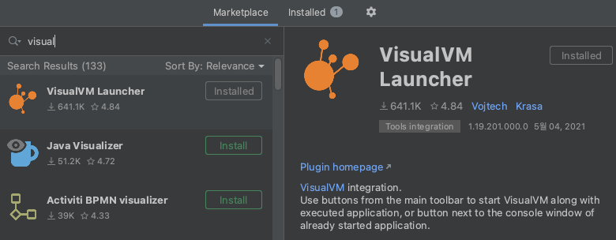
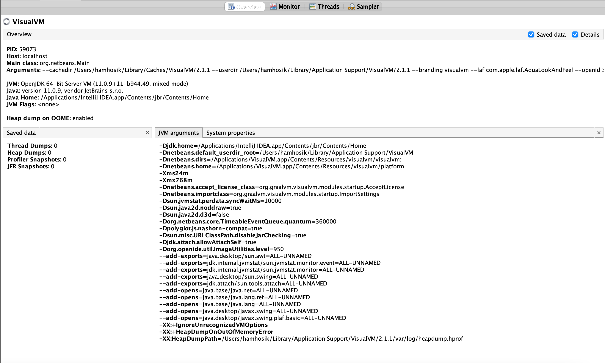
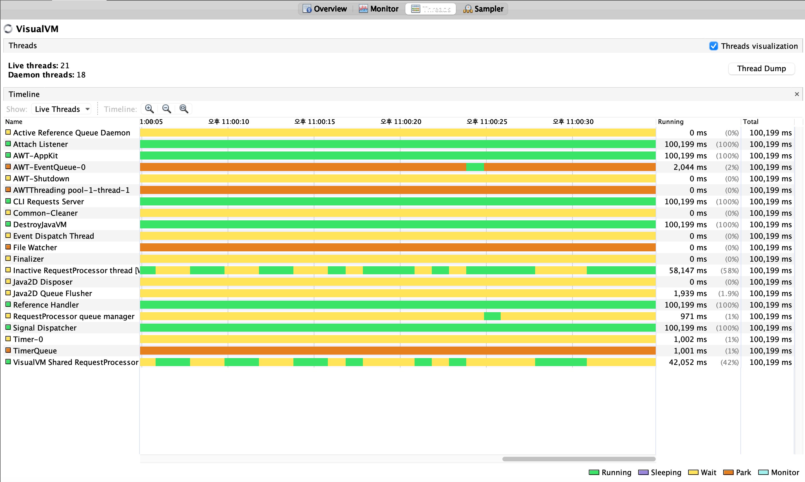
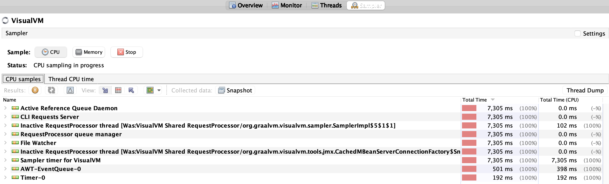
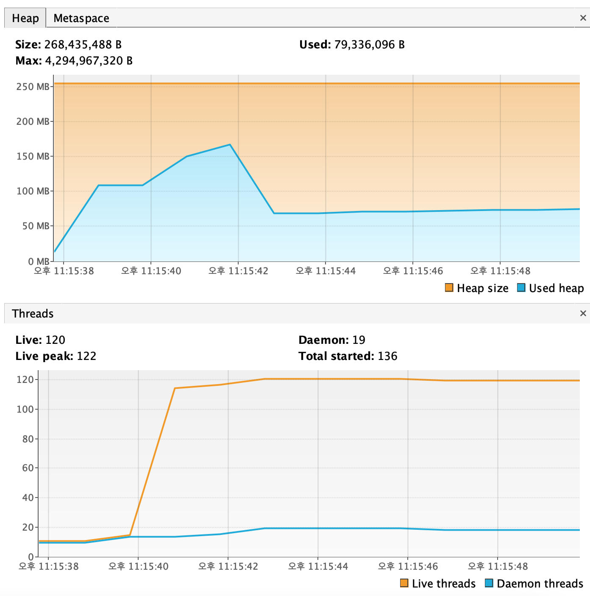

11. 확장과 튜닝

#### 배치 처리 프로파일링하기

intelliJ plulgins


run and debug


overview:   
-> 실행중인 자바 애플리케이션의 전체적인 내용을 제공하고, JVM에 전달된 arguments가 포함된다.


monitor:   
-> CPU, 메모리 사용률, 로딩된 클래스 수, 수행중인 데몬 스레드 수를 보여준다.   
-> 추후 분석을 위해 힙 덤프를 생성할 수도 있다.


thread:   
-> 애플리케이션이 실행한 모든 스레드와 해당 스레드가 어떤 작업을 하는지 알려준다.


sampler:   
-> 애플리케이션의 CPU와 메모리 할당 상태를 순간적으로 잡아내, 스냅샷을 만들 수 있다.


---

```java
    // 메모리 사용률을 높이기 위해 test 문자열에 문자열 반복적 추가
    // thread 개수를 늘리기 위해 100개 생성 후 실
    @Bean
    public ItemWriter<String> visualVMItemWriterLab1() {
        ExecutorService executorService = Executors.newFixedThreadPool(100);
        for (int i = 0; i < 100; i++) {
            executorService.submit(() -> {
                String test = "test";
                for (int j = 0; j < 1000; j++) {
                    test += "test";
                    System.out.println(test);
                }
            });
        }

        executorService.shutdown();
        try {
            executorService.awaitTermination(60, TimeUnit.SECONDS);
        } catch (InterruptedException e) {
            log.error("executorService shutdown error!");
        }

        return items -> {
            log.info("ItemWriter items :: {}", items);
        };
    }
```

메모리 사용률이 늘어나고,   
live peak thread 수가 122까지 늘어남


---

#### 다중 스레드 스텝

해당 스텝이 TaskExecutor를 참조하도록 구성하면 된다.

`taskExecutor(new SimpleAsyncTaskExecutor())`
스텝 내에서 실행되는 각 청크용으로 새 스레드를 생성해 각 청크를 병렬로 실행한다.   
+) 잡의 각 스텝 내에서 `아이템 청크`를 `병렬로 처리`하는 기능을 제공한다.

```java
    @Bean
    public Step multiThreadStepLab2() {
        return this.stepBuilderFactory.get("multiThreadStepLab2")
                .<String, String>chunk(CHUNK_SIZE)
                .reader(multiThreadItemReaderLab2())
                .writer(multiThreadItemWriterLab2())
                .taskExecutor(new SimpleAsyncTaskExecutor())
                .build();
    }
```

메인 스레드에서 실행
```
2021-11-10 23:25:57.907  INFO 63081 --- [           main] h.c.l.j.MultiThreadStepConfigurationLab2 : ItemWriter items :: [test0, test1, test2, test3, test4]
2021-11-10 23:25:57.911  INFO 63081 --- [           main] h.c.l.j.MultiThreadStepConfigurationLab2 : ItemWriter items :: [test5, test6, test7, test8, test9]
2021-11-10 23:25:57.915  INFO 63081 --- [           main] h.c.l.j.MultiThreadStepConfigurationLab2 : ItemWriter items :: [test10, test11, test12, test13, test14]
2021-11-10 23:25:57.918  INFO 63081 --- [           main] h.c.l.j.MultiThreadStepConfigurationLab2 : ItemWriter items :: [test15, test16, test17, test18, test19]
```

다중 스레드로 실행 (cTaskExecutor-1,2,3,4, ...)
```
2021-11-10 23:30:37.210  INFO 63711 --- [cTaskExecutor-2] h.c.l.j.MultiThreadStepConfigurationLab2 : ItemWriter items :: [test0, test1, test5, test9, test13]
2021-11-10 23:30:37.210  INFO 63711 --- [cTaskExecutor-3] h.c.l.j.MultiThreadStepConfigurationLab2 : ItemWriter items :: [test0, test3, test7, test11, test15]
2021-11-10 23:30:37.210  INFO 63711 --- [cTaskExecutor-4] h.c.l.j.MultiThreadStepConfigurationLab2 : ItemWriter items :: [test0, test2, test4, test8, test12]
2021-11-10 23:30:37.210  INFO 63711 --- [cTaskExecutor-1] h.c.l.j.MultiThreadStepConfigurationLab2 : ItemWriter items :: [test0, test3, test6, test10, test14]
```

---

#### 병렬 스텝

서로 관련없는 스텝을 동시에 실행할 때 성능을 향상 시킬 수 있다.

```java
    @Bean
    public Job parallelJobLab3() {
        Flow secondFlow = new FlowBuilder<Flow>("secondFlow")
                .start(parallelStepLab3_2())
                .build();

        Flow parallelFlow = new FlowBuilder<Flow>("parallelFlow")
                .start(step1())
                .split(new SimpleAsyncTaskExecutor())
                .add(secondFlow)
                .build();


        return this.jobBuilderFactory.get("parallelJobLab3")
                .start(parallelFlow)
                .end()
                .incrementer(new UniqueRunIdIncrementer())
                .build();
    }
```

각 Step이 `cTaskExecutor-1`, `cTaskExecutor-2`에서 실행됨.
```
2021-11-10 23:39:20.376  INFO 64702 --- [cTaskExecutor-2] o.s.batch.core.job.SimpleStepHandler     : Executing step: [parallelStepLab3_1]
2021-11-10 23:39:20.378  INFO 64702 --- [cTaskExecutor-1] o.s.batch.core.job.SimpleStepHandler     : Executing step: [parallelStepLab3_2]
2021-11-10 23:39:20.391  INFO 64702 --- [cTaskExecutor-1] m.h.c.l.j.ParallelStepConfigurationLab3  : ItemWriter items :: [test1]
2021-11-10 23:39:20.391  INFO 64702 --- [cTaskExecutor-2] m.h.c.l.j.ParallelStepConfigurationLab3  : ItemWriter items :: [test1]
2021-11-10 23:39:20.396  INFO 64702 --- [cTaskExecutor-1] o.s.batch.core.step.AbstractStep         : Step: [parallelStepLab3_2] executed in 18ms
2021-11-10 23:39:20.396  INFO 64702 --- [cTaskExecutor-2] o.s.batch.core.step.AbstractStep         : Step: [parallelStepLab3_1] executed in 19ms
```